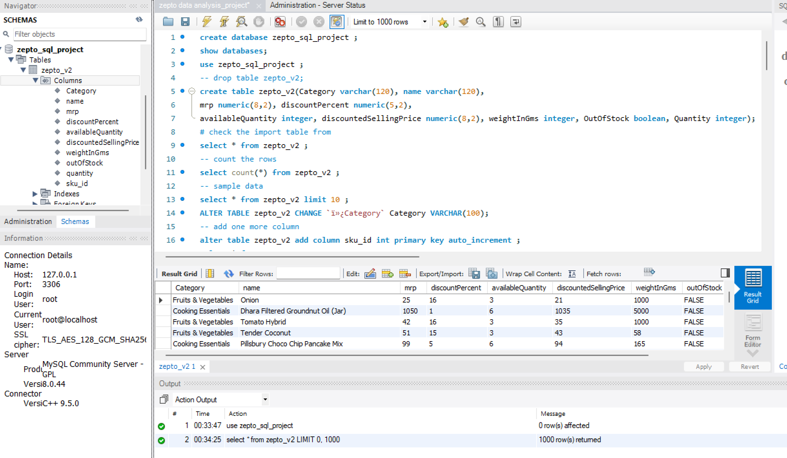
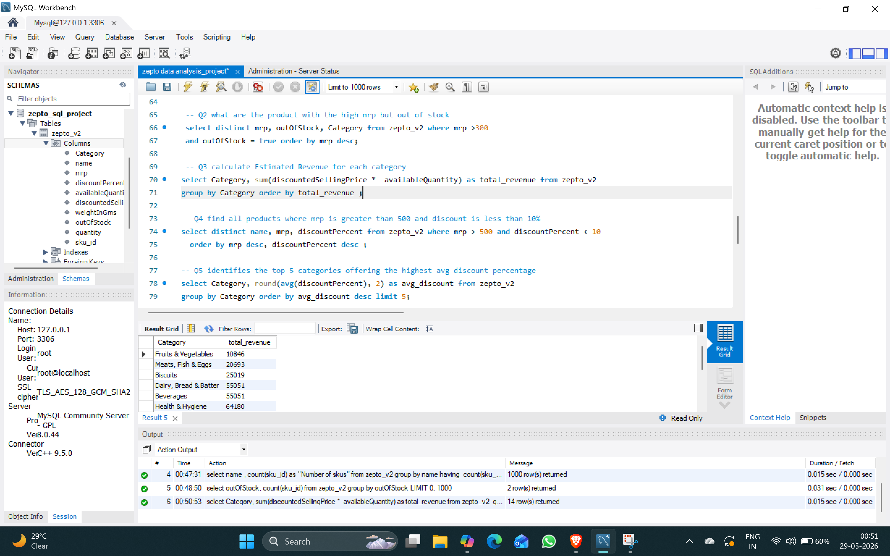
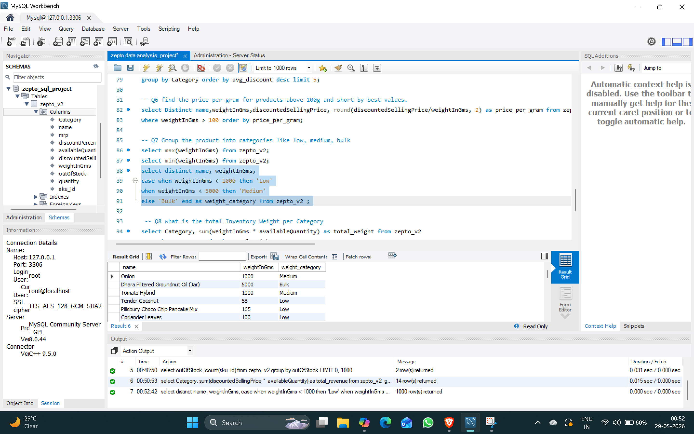

# 🗄️ Zepto Data Analysis (SQL Project)
## 📌 Overview
This project demonstrates SQL-based analysis of Zepto’s product dataset.  
It covers schema creation, data import, cleaning, and business insight queries such as product categorization, revenue estimation, and stock analysis.

## ⚙️ Tech Stack
- MySQL Workbench
- SQL (DDL + DML queries)

## 📊 Schema Setup


### 1. Product Out of Stock vs In Stock


### 2. Estimated Revenue for Each Category


### 3. Group Products into Categories (Low, Medium, Bulk)



## 🔑 Key Queries & Results

### 1. Checking for Null Values
```sql
SELECT COUNT(*) AS null_count
FROM zepto_v2
WHERE category IS NULL 
   OR name IS NULL 
   OR mrp IS NULL 
   OR discountedSellingPrice IS NULL;
### 2.Estimated Revenue for Each Category
SELECT Category, SUM(discountedSellingPrice * availableQuantity) AS total_revenue
FROM zepto_v2
GROUP BY Category
ORDER BY total_revenue DESC;

